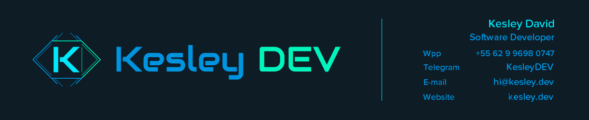
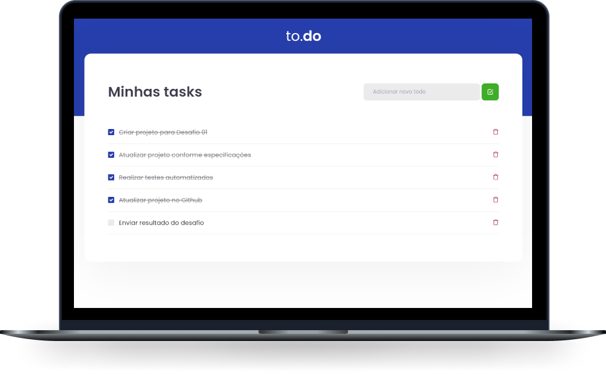

<h1 align="center">
  
</h1>

    
    <h3 align="center">To.do</h3>

  <a href="#-preview">Preview</a>&nbsp;&nbsp;&nbsp;|&nbsp;&nbsp;&nbsp;
  <a href="#-project">Project</a>&nbsp;&nbsp;&nbsp;|&nbsp;&nbsp;&nbsp;
  <a href="#-technologies">Technologies</a>&nbsp;&nbsp;&nbsp;|&nbsp;&nbsp;&nbsp;
  <a href="#-layout">Getting started</a>&nbsp;&nbsp;&nbsp;|&nbsp;&nbsp;&nbsp;
  <a href="#-tests">Tests</a>&nbsp;&nbsp;&nbsp;|&nbsp;&nbsp;&nbsp;
  <a href="#-license">License</a>

  <!-- <a href="#">🚧</a> -->

  

  

  

  

    

## ⚡️ Preview

Sistema Online  
[https://study-ignite-react-challenge-01.vercel.app/](https://study-ignite-react-challenge-01.vercel.app//)

## 💻 Project

Nesse desafio, você deverá criar uma aplicação para treinar o que aprendeu até agora no ReactJS

Essa será uma aplicação onde o seu principal objetivo é uma pequena aplicação de atividades a fazer, para treinar um pouco mais sobre manipulação do estado no React.

- Adicionar uma nova tarefa
- Remover uma tarefa
- Marcar e desmarcar uma tarefa como concluída
  
Este é um projeto desenvolvido durante o treinamento **[Ignite - Trilha React](https://rocketseat.com.br/)**, realizada pela **[@Rocketseat](https://github.com/Rocketseat)**.

## 🚀 Technologies

Esse projeto foi desenvolvido utilizando as seguintes tecnologias:

- [React](https://reactjs.org)
- [TypeScript](https://www.typescriptlang.org/)
- [Jest](https://jestjs.io/)

## 🥇 Tests

## 📝 License

Esse projeto está sob a licença MIT. Veja o arquivo [LICENSE](LICENSE) para mais detalhes.

---

Feito com ♥ by Kesley DEV
